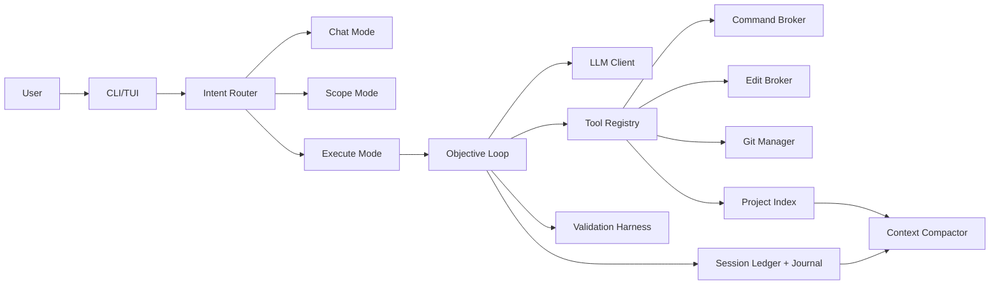

# Code Buddy Specification

Status: Draft v0.2
Date: 2026-06-27
Working name: Code Buddy

## 1. Summary

Code Buddy is a Python-implemented, Windows-only, terminal-first coding agent inspired by tools like Claude Code, Codex, and OpenCode. It uses an API-hosted LLM, with an Azure-authenticated OpenAI-compatible `openai/gpt-5.4` deployment provider/model and Perplexity as the development/test provider, and operates inside one explicitly selected local project workspace.

"Python-only" means Code Buddy itself is implemented in Python and does not require Node.js. It may inspect and edit any text-based project on a best-effort basis, while Python projects receive first-class support.

The core promise is not merely "chat with files." Code Buddy must safely understand a project, execute useful development workflows, edit files reliably, validate its work, preserve continuity across context loss, and recover cleanly after interruptions.

The most important v1 quality bar is reliable, non-destructive editing. All mutating actions must pass through deterministic brokers, be journaled, and be reversible where practical.

## 1.1 Refined V1 Non-Negotiables

Prototype testing exposed a core requirement: Code Buddy is not "the OpenCode repo running tools." Code Buddy is a project-bound agent runtime. The implementation repository and the target project are separate concepts at all times.

Runtime and launch requirements:

- Code Buddy must run without being packaged as an executable.
- Code Buddy may also ship as an executable later.
- Non-executable use must still be a simple terminal call from any project, such as `buddy` after setup or a single launcher command.
- Users must not need to manually set `PYTHONPATH`, pass source paths, or export per-run variables for normal use.
- When started from a terminal inside project X, project X is the default target project.
- If a folder picker is shown, it must open at the process launch directory, not at the Code Buddy implementation repo and not at an old remembered project.
- Explicit `--root` or an explicit folder-picker selection wins over the launch directory.
- A last-used project may be offered only as a secondary convenience; it must never override the current launch directory.

Project binding requirements:

- Every chat, objective, file operation, git operation, command, journal, transcript, work plan, index, and compaction artifact is bound to the selected project root.
- The Code Buddy implementation repo must never become the implicit target merely because the launcher lives there.
- Runtime UI should display the active project root clearly.
- Any attempt by the model or tool layer to read or mutate the Code Buddy source tree while the target project is different must be treated like outside-project access and require policy handling.
- Project-local state lives under `<project>/.buddy/`.
- Conversation history lives under `<project>/.buddy/sessions/<session-id>/conversation.jsonl`.
- Context compaction must use the project-local conversation history, ledger, journal, work plans, and index.

Authentication and provider requirements:

- Deployment auth is always the Azure/AI Mark client shared with the workspace.
- The deployment provider must import auth from `ai_mart`.
- The deployment provider must import the endpoint/base URL from `ai_mart`; it must not require an endpoint URL system environment variable.
- The required `ai_mart.py` contract is `auth_client.authenticate_broker().access_token` for the bearer token and `base_url` for the OpenAI-compatible endpoint.
- The deployment model is `openai/gpt-5.4`.
- Perplexity remains a development/test provider and may continue to use `PERPLEXITY_API_KEY`.

Command and git requirements:

- All commands run with cwd set to the selected project root unless an explicit project-safe subdirectory is requested.
- Git commands operate on the selected project repo, not the Code Buddy repo.
- Command policy outcomes must be deterministic: run, deny with a clear reason, or ask for approval once.
- Once approval is given for a pending command or branch action, the approved action must execute exactly once and the pending approval must be cleared.
- Code Buddy must not repeatedly ask for the same approval after it was granted.
- Long-running commands must have visible progress, timeout handling, and a clean unblock path. Hanging silently is a product bug.

Editing requirements:

- All file creation, modification, rename, and delete operations must go through the edit broker or another deterministic broker with equivalent journaling and rollback behavior.
- Edits must be scoped to the selected project root by default.
- Malformed model tool calls must not crash or create partial edits. The runtime should repair, reject with a clear error, or ask the model for a corrected tool call within a bounded loop.
- Python file edits must be syntax-checked before write; malformed Python must be rejected without modifying the file.
- Successful edit objectives must prove that expected files changed before reporting success.

## 2. Product Goals

- Provide a Claude/Codex-level terminal experience without requiring Node.js.
- Support multiline terminal input, pasted code, long prompts, and external-editor input.
- Safely run useful terminal commands such as `git`, `rg`, `grep`, test runners, linters, and formatters.
- Read, write, and edit text files with robust safeguards.
- Loop over clear objectives until completion, validation failure, user intervention, or a real blocker.
- Distinguish chat, scoping, and execution instead of treating every prompt as an objective.
- Maintain durable session state so the agent can implicitly resume after context compaction, restart, crash, or token exhaustion.
- Understand large codebases through indexing, search, working sets, and structured memory rather than relying on raw chat context.
- Support documentation, test creation, formatting, debugging, and analysis workflows.
- Be configurable through a project harness while remaining safe by default.

## 3. V1 Must-Haves

- Python 3.12+ implementation.
- Windows-only support.
- No Node.js runtime dependency for Code Buddy itself.
- Runnable from source without packaging as an executable.
- Installable and runnable through a documented Windows-first onboarding path.
- Optionally packageable as an executable without changing runtime semantics.
- Callable from any terminal after setup while binding to that terminal's launch project.
- Terminal-first CLI/TUI.
- Multiline input, bracketed paste support, history, and `$EDITOR` fallback.
- Provider-neutral LLM layer with deployment default `azure_openai/openai/gpt-5.4`.
- Deployment auth and endpoint loaded from `ai_mart`.
- OpenAI-compatible API adapters for OpenAI and Perplexity.
- Native tool/function-call support when available.
- Structured text tool-call fallback when native tool calls are unavailable.
- Hybrid intent routing across chat, scope, and execute modes.
- Configurable tool registry.
- Deterministic command broker with policy controls.
- Deterministic edit broker with transactional safety.
- Always-bound project root for chat, tools, git, commands, state, index, and history.
- Project-root file access boundary by default.
- Text-file-only direct edits.
- Secret and sensitive-file protection.
- Durable local transcript, journal, task ledger, and session state.
- Context compaction based on structured state, not generic summarization alone.
- Context compaction must respect a configurable approximate token budget.
- Codebase intelligence/indexing layer for large projects.
- Harness-driven validation.
- Git-aware branch-isolated workflow.
- Agent-owned git branch for mutating work.
- Optional auto checkpoint commits on the agent branch after useful validated milestones.
- `/clear`, `/compact`, `/status`, `/skills`, `/undo`, `/yolo`, `/exit`, and git-related slash commands.
- Project-local skills under `.buddy/skills/*.md` callable as `/skill-name <request>`.
- `codebuddy doctor` or equivalent health check for installation, auth, config, shell, and project readiness.
- Local-only logging and telemetry.
- Internal reliability test suite for the agent itself.

## 4. Non-Goals For V1

- No full GUI beyond native OS dialogs such as folder picker.
- No Node.js dependency.
- No external telemetry.
- No cloud sync.
- No remote plugin marketplace.
- No autonomous background daemon.
- No fully unguarded destructive shell mode.
- No guaranteed first-class support for every language and framework.
- No general interactive terminal sessions or arbitrary pseudo-terminal control.
- No silent modification of user-owned instruction files.
- No direct binary-file editing.
- No embeddings/vector search as a required core dependency.

## 5. Target Use Cases

Code Buddy v1 should focus on:

- Code documentation: docstrings, comments, README edits, and developer docs.
- Test creation: `pytest`, `unittest`, Python Playwright where available, and configured project validators.
- Code formatting: formatter-first behavior using tools like `ruff`, `black`, and `isort`.
- Debugging: reproduce, inspect, instrument temporarily, fix, validate, and clean up.
- Analysis: explain code, architecture, risks, failure modes, diffs, and test gaps.

Primary repo fit:

- Python projects.
- Text-heavy mixed-language projects where generic search, editing, git, and configured validation are enough.
- Local Windows workspaces where Node.js is unavailable or undesirable.

V1 should not imply first-class semantic understanding of every language. For non-Python stacks, Code Buddy should operate through text editing, lexical search, configured commands, and project instructions.

## 6. User Experience

Code Buddy is terminal-first.

Expected entry points:

- `buddy`
- `buddy "explain this project"`
- `buddy "add tests for the parser"`
- `buddy chat`
- `buddy --new`
- A direct source launcher for no-install use, for example `C:\path\to\CodeBuddy\run-buddy.cmd`

The user-facing command is `buddy`. The Python package/module name is `codebuddy`.

The interactive terminal experience must support:

- Natural multiline input where `Enter` submits and `Shift+Enter` inserts a newline when supported by the terminal.
- A reliable newline fallback such as `Esc` then `Enter` for terminals that do not expose modified Enter keys.
- Bracketed paste, so pasted multiline code is inserted as text rather than submitted line by line.
- Prompt history.
- Colorized, readable Markdown-ish output.
- Streaming LLM responses.
- Visible tool activity resembling Claude Code: git branch changes, file reads/searches, shell commands, file edits, and validation should be shown inline as concise colored action rows.
- Concise status updates during long work.
- `$EDITOR` fallback for long prompts.
- Clear indication of current mode and YOLO state.
- `/yolo` must approve any currently pending command or branch request once when it is switched on.
- Graceful handling of Ctrl+C and interrupted tool runs.

Streaming requirements:

- OpenAI-compatible server-sent-event content deltas must be parsed by the LLM layer.
- OpenAI-compatible streamed native tool-call deltas must be assemblable into normal tool-call records.
- The terminal renderer must support displaying streamed assistant chunks.
- Tool-using turns may choose non-streaming completion when that produces a simpler deterministic retry loop, but the transport layer must support both streamed content and streamed tool-call reconstruction.

When launched without an explicit project root, the Windows entry point should open a native folder picker instead of requiring the user to paste a path. The folder picker must default to the directory from which the user started Code Buddy. If Code Buddy was launched from `C:\work\project-x`, the picker opens at `C:\work\project-x`, even when the launcher code lives at `C:\tools\CodeBuddy`.

Project root selection order:

1. Explicit `--root`.
2. Explicit folder-picker selection.
3. Process launch directory.
4. Last-used project only when the launch directory is unavailable or invalid.

The selected project root owns its `.buddy` state. The Code Buddy source repo is not the target project unless the user explicitly selects it.

When an interactive chat starts and the active project has unfinished work, Code Buddy must show a concise resume summary and ask whether to continue or start fresh. Starting fresh opens a new session and clears the active work-plan pointer so stale pending tasks do not bleed into new work.

On every interactive spawn or one-shot prompt execution, Code Buddy must refresh a bounded project map before the user asks the first question. The map must be stored under the project root, not globally:

- `.buddy/index/project_map.md`
- `.buddy/index/project_memory.json`

The project map must include:

- Project root.
- Active session id, mode, objective, pending next step, and plan.
- Files inspected, files edited, commands run, and blockers from the active ledger when present.
- File map with sensitive paths excluded.
- Key documentation and manifest snippets such as `README.md`, `AGENTS.md`, `SPEC.md`, `pyproject.toml`, and equivalent files.
- Source symbols where cheap deterministic extraction is available.
- Deterministic module summaries persisted to `.buddy/index/module_summaries.json`.

The first model call in a project-aware turn must receive this project context. The agent must not answer project questions from generic prior knowledge when local context is available.

Recommended Python dependencies:

- `prompt_toolkit` for terminal input.
- `rich` for rendering, progress, panels, diffs, and status output.
- `httpx` for API calls.
- `pydantic` or dataclasses for typed config and state.

## 7. Slash Commands

Slash commands override the intent router and expose common controls.

Required v1 commands:

- `/clear`: start a fresh active chat context while preserving project memory, journals, config, index, and historical sessions.
- `/compact`: manually trigger context compaction.
- `/status`: show current mode, objective, plan, touched files, git state, validation state, and pending blockers.
- `/undo`: undo the last mutating action where possible.
- `/undo-session`: undo all reversible mutating actions from the current session, subject to confirmation.
- `/yolo`: toggle YOLO mode.
- `/exit`: quit cleanly after saving session state.
- `/ask`: force chat/answer mode.
- `/scope`: force scoping mode.
- `/do`: force execution mode.
- `/plan`: show or update the current plan.
- `/review`: review current changes.
- `/branch`: inspect or create an agent branch.
- `/commit`: create a git commit from appropriate agent-owned changes.
- `/diff`: show relevant git diff.
- `/merge-ready`: summarize completed work and propose merge readiness.
- `/editor`: open external editor for composing a prompt.

`/clear` must not delete durable project memory, sessions, journals, indexes, or config. It clears only the active conversation context.

## 8. Operating Modes

Code Buddy must distinguish at least three modes.

### 8.1 Chat Mode

Used for questions, explanations, brainstorming, and analysis.

Properties:

- No filesystem mutation.
- No shell mutation.
- Safe read-only inspection may be allowed when needed.
- Answers should cite local evidence when discussing code.

### 8.2 Scope Mode

Used when the request is broad, vague, risky, or requires shared understanding before execution.

Properties:

- May inspect project files and run safe read-only commands.
- May produce plans, specs, acceptance criteria, or implementation options.
- Must ask clarifying questions when scope or intent is unclear.
- Should batch questions during broad planning.
- Must not implement unless the user explicitly approves or switches to execute mode.

### 8.3 Execute Mode

Used for clear objectives where Code Buddy should act.

Properties:

- Runs the objective loop.
- Uses command and edit brokers.
- Validates work.
- Iterates on failures.
- Stops for user input only on ambiguity, safety approval, policy gates, or true blockers.

## 9. Intent Routing

Intent routing should be hybrid:

- Slash commands always win.
- Deterministic rules handle obvious chat, scope, and execute prompts.
- An LLM classifier may classify ambiguous prompts.
- Low-confidence classification should trigger clarification.
- The chosen mode must be recorded in the session ledger.

Routing examples:

- "What does this repo do?" -> chat or read-only analysis.
- "Explore whether we can add a plugin system; do not code yet" -> scope.
- "Add pytest coverage for the config parser" -> execute.
- "Fix this failing test" -> execute.
- "Let's design this first" -> scope.

## 10. Objective Loop

Execution mode runs a bounded but persistent objective loop.

Required phases:

1. Interpret objective.
2. Gather context.
3. Define or infer completion criteria.
4. Create a plan.
5. Execute safe tool actions.
6. Edit through the edit broker.
7. Validate through the harness.
8. Reflect on failures.
9. Retry when the next step is clear.
10. Stop when done, blocked, or approval is required.
11. Summarize outcome, checks, changed files, and residual risks.

Budgets such as max elapsed time, max LLM calls, max validation retries, and max tool calls may be configurable, but they are not the primary continuity mechanism. Durable session state is mandatory so the agent can resume even when budgets, context windows, crashes, or restarts interrupt work.

## 11. Completion Criteria

Code Buddy must not declare success just because it made edits.

For execution tasks, completion requires:

- User request is satisfied.
- Intended files were changed.
- Unrelated files were not changed.
- Edit broker checks passed.
- Validation commands passed, or failures are clearly unrelated and documented.
- Temporary debugging instrumentation was removed unless the user approved keeping it.
- Git state is understood.
- Final response lists changed files, validation performed, and residual risks.

For analysis-only tasks, completion requires:

- Conclusions are grounded in inspected evidence.
- Uncertainty is stated clearly.
- Suggested next steps are separated from findings.

## 12. Clarification And Uncertainty Policy

Code Buddy should clear uncertainty with clarifying questions when uncertainty affects:

- Scope.
- User intent.
- Safety.
- Data-loss risk.
- Acceptance criteria.
- Whether to modify files.
- Whether to run risky commands.

If uncertainty is technical and answerable locally, Code Buddy should inspect files or run safe validation before asking.

If an assumption is low-risk and the request is straightforward, Code Buddy may proceed, but it must record the assumption and mention it when relevant.

During broad scoping, questions may be batched. During execution blockers, questions should usually be asked one at a time.

## 13. Architecture Overview

High-level components:

- CLI/TUI shell.
- Intent router.
- Agent loop.
- LLM client abstraction.
- Tool registry.
- Command broker.
- Edit broker.
- Validation harness.
- Context manager and compactor.
- Project indexer.
- Session manager.
- Journal and undo manager.
- Git manager.
- Config loader.
- Secret redactor.

Conceptual flow:



## 14. LLM Layer

The LLM layer must be provider-neutral.

Default deployment provider:

- Provider: `azure_openai`
- Model: `openai/gpt-5.4`
- API style: OpenAI-compatible
- Auth style: external `azure_auth:AzureAuthClient` token provider
- Default AI Mark bridge: `azure_auth` imports `auth_client` from `ai_mart` and returns `auth_client.authenticate_broker().access_token`
- Default endpoint bridge: the Azure/OpenAI provider imports `base_url` from `ai_mart`
- Deployment default must not require `AZURE_OPENAI_BASE_URL`

Development/test provider:

- Provider: `perplexity`
- Model: `sonar-pro`, unless overridden
- API style: OpenAI-compatible

The core should define an `LLMClient` abstraction that supports:

- Chat/completion requests.
- Streaming.
- Native tool/function calls where available.
- Strict structured text tool-call fallback.
- Usage metadata when available.
- Retries.
- Rate-limit handling.
- Configurable timeout.
- Model roles.

Required model roles:

- Main agent.
- Intent router/classifier.
- Compactor.
- Reviewer/validator.

All deployment roles may default to `azure_openai/openai/gpt-5.4` in v1. Development and test roles may be pointed at Perplexity. The role abstraction should exist even if only one model is configured.

## 15. Tool Registry

Tools must be registered through a Python tool registry.

V1 built-in tool groups:

- File read and metadata.
- Search.
- Edit.
- Shell command.
- Validation.
- Git.
- Project index.
- Context compaction.
- Session status.
- Undo.

Tool registry requirements:

- Tools have schemas.
- Tools can be enabled or disabled by harness config.
- Tool calls are validated before execution.
- The same schema can be exposed as native LLM tools or text fallback instructions.
- Tool results are structured.
- Mutating tool calls are journaled.
- Adding project-local tools later should be easy through Python import paths.

The agent loop must support both native OpenAI-compatible `tool_calls` and the structured text fallback. For execution tasks, tool results must be fed back into the model across bounded iterations until the model provides a final answer, the objective is blocked, or the configured iteration budget is reached.

V1 does not need a plugin marketplace.

## 16. Command Broker

All shell commands must go through the command broker. The LLM must not receive raw, unrestricted shell access.

Default shell:

- PowerShell 7 if available.
- Windows PowerShell fallback.

Command broker responsibilities:

- Classify commands by risk.
- Enforce policy.
- Resolve cwd.
- Normalize encoding.
- Capture stdout, stderr, exit code, duration, and timeout status.
- Stream output when useful.
- Truncate or summarize large output for LLM context.
- Store full output locally when permitted.
- Redact secrets.
- Journal all commands.
- Prevent unsafe command construction.

Command risk classes:

- `auto`: safe read-only or validation commands.
- `confirm`: common but mutating commands that require approval in normal mode.
- `deny`: dangerous commands blocked by default.

Approval behavior:

- A `confirm` command creates one pending approval with the exact command and cwd recorded.
- Approval can be granted through `/approve`, `/a`, `yes`, or an equivalent UI affordance.
- Once approved, the exact pending command executes once with cwd still scoped to the selected project.
- After execution, the pending approval is cleared whether the command succeeds, fails, or times out.
- A denied command does not enter the pending-approval loop. The agent explains the policy denial and asks for an alternate path if needed.
- The agent must not ask for approval repeatedly for the same already-approved action.
- The agent must not silently keep thinking while waiting for user approval.

YOLO mode:

- Skips `confirm` prompts.
- Still warns on hard-deny actions.
- Hard-deny actions require final explicit approval if the config allows bypass.
- All bypasses are journaled.

Examples of generally safe commands:

- `git status`
- `git diff`
- `git log`
- `rg`
- `grep`
- `Get-ChildItem`
- `pytest` when used for validation
- `python -m unittest`
- `ruff check`
- `mypy`

Examples of commands requiring confirmation or stricter policy:

- Formatter commands that write files.
- Package installs.
- Git branch creation.
- Git commit.
- File moves.
- Deleting files.
- Long-running commands.
- Network commands.

Examples of hard-deny or final-approval commands:

- Recursive delete over broad paths.
- `git reset --hard`.
- Force push.
- Registry edits.
- Credential store access.
- Commands that print environment secrets.
- System-wide changes.

V1 should not support arbitrary interactive terminal programs. Commands are subprocess-style with timeouts and captured output.

## 17. Large Command Output Handling

Large outputs must not be pasted wholesale into the LLM context.

Requirements:

- Store full output locally when size and privacy policy allow.
- Redact secrets before storage or display.
- Send only relevant summaries to the LLM.
- Preserve head, tail, and matched error regions.
- Record truncation explicitly.
- Allow later retrieval by local reference.
- Avoid context blowups from logs, test output, and generated files.

## 18. Edit Broker

All file mutation must go through the edit broker.

The edit broker is a deterministic safety layer. The LLM may propose edit intent, but the broker owns application, verification, journaling, and rollback data.

Core requirements:

- Text files only.
- Project-root boundary by default.
- File creation, replacement, append, rename, and delete must all use brokered operations.
- The broker must reject target paths outside the selected project root unless policy explicitly permits the operation.
- Reading outside the project root requires confirmation unless explicitly allowed by config.
- Writing outside the project root requires confirmation and should usually be denied.
- Sensitive paths are protected even inside the project root.
- File must be read before editing.
- File hash must be recorded before and after editing.
- Encoding must be detected where practical.
- UTF-8 is the default.
- BOM must be preserved if present.
- Existing newline style must be preserved.
- Final newline behavior must be preserved unless intentionally changed.
- CRLF must be handled correctly.
- Edits must be atomic through temp file plus replace, or an equivalently safe Windows-compatible mechanism.
- The edited file must be re-read after mutation.
- Syntax/format validation should run when practical.
- All edits must be journaled.
- Undo data must be stored.

Supported v1 edit types:

1. Exact replace.
   - Replace a unique exact block.
   - Reject if the block is missing or appears more than once.

2. Anchored patch.
   - Apply a unified diff or structured patch with surrounding context.
   - Reject if context no longer matches.
   - Report precise mismatch diagnostics.

3. Restricted whole-file rewrite.
   - Allowed only for small files, generated files, new files, or explicit user-approved rewrites.
   - Must still preserve encoding/newline policy when applicable.

The LLM should not directly overwrite arbitrary files.

## 19. Dirty Worktree Protection

Code Buddy must work safely in dirty repositories.

Requirements:

- Inspect git status before mutating tracked files.
- Never revert unrelated user changes.
- Read and patch current file contents.
- If a planned edit overlaps ambiguous user changes, ask.
- Journal before/after hashes.
- Final summary should distinguish pre-existing dirty state from agent-created changes where practical.

## 20. Undo And Journal

Every mutating action must write to an append-only session journal.

Suggested location:

```text
.buddy/sessions/<session-id>/journal.jsonl
```

Journal entries should include:

- Timestamp.
- Session id.
- Objective id.
- Tool/action name.
- Target paths.
- Command text or edit operation.
- Risk classification.
- Approval status when relevant.
- File hash before and after.
- Diff or patch applied.
- Validation results.
- Rollback data when possible.
- Redaction status.

Undo requirements:

- `/undo` reverts the most recent reversible mutation.
- `/undo-session` attempts to revert all reversible mutations in the current session.
- Undo must respect current file drift and refuse unsafe rollback.
- Undo actions themselves must be journaled.

## 21. File Access And Secret Protection

Default file scope:

- Current project root.

Requirements:

- Path resolution must prevent traversal mistakes and wrong-root edits.
- Reading outside the project root requires confirmation unless config allows it.
- Writing outside the project root requires stricter confirmation and should usually be denied.
- Binary files cannot be directly edited.
- Binary metadata may be read: path, size, hash, and timestamps.

Sensitive data policy:

- Detect common secret files such as `.env`, SSH keys, credential files, API tokens, and private certificates.
- Avoid reading sensitive files unless explicitly allowed.
- Never send secret contents to the LLM by default.
- Redact likely secrets in logs, journals, compaction summaries, command output, and final responses.
- Config may mark additional sensitive paths.

## 22. Validation Harness

Validation must be harness-driven.

Sources of validation:

- Explicit project config.
- Inferred Python tools.
- Task-specific checks.
- Non-command checks.

Validation behavior:

- Configured validation commands always win.
- Targeted validation should run before broad validation when appropriate.
- Validation failures feed back into the objective loop.
- The agent may retry if the next corrective action is clear.
- The agent should stop and ask when failures indicate ambiguous requirements.

Python-first validators:

- `pytest`
- `python -m unittest`
- `ruff check`
- `ruff format --check`
- `black --check`
- `mypy`
- Python Playwright, if installed and configured

Non-command checks:

- File exists.
- Intended path changed.
- No unrelated path changed.
- Python syntax parses.
- Imports resolve where practical.
- Patch applied exactly once.
- Generated diff is scoped to the objective.

## 23. Context, Compaction, And Continuity

Code Buddy must handle large codebases without relying on a single large prompt.

Compaction alone is insufficient. V1 requires structured state plus project intelligence.

Persistent session state should track:

- Current objective.
- Current mode.
- Plan items and status.
- Completed actions.
- Pending next step.
- Files inspected.
- Files edited.
- Commands run.
- Validation state.
- Blockers.
- Clarifying questions.
- Assumptions.
- User decisions.
- Compact summaries.
- References to full local artifacts.

Compaction should preserve:

- Objective state.
- Decisions.
- Assumptions.
- Relevant file paths.
- Important command results.
- Failed attempts.
- Validation status.
- Next actions.
- Why files are in the working set.

Compaction must not replace exact source reads before edits. Before editing or making precise claims, Code Buddy must re-ground itself in current files.

Resume behavior:

- Resume is implicit.
- Each project has a current active session.
- On startup, Code Buddy restores the last active session.
- It should show a concise resumed-session note.
- Starting fresh is explicit through `/clear`, `codebuddy --new`, or equivalent.

## 24. Codebase Intelligence Layer

Large-codebase support is a core subsystem.

V1 should include:

- Fast lexical search through `rg` when available.
- Fallback search when `rg` is unavailable.
- File tree map.
- Git-tracked file awareness.
- Python AST symbol extraction.
- Python import graph where practical.
- File hashes for incremental indexing.
- Working set tracking.
- Path and symbol references in session state.
- Retrieval rules that pull exact snippets for the LLM.

The index should help Code Buddy know where to look, but it must not become an unverified source of truth for edits. Current file contents always win.

Embeddings/vector search may be added later, but v1 should not depend on them.

## 25. Project Memory And Instructions

Code Buddy uses two memory layers.

### 25.1 User-Owned Instructions

Canonical file:

```text
AGENTS.md
```

Behavior:

- Honor existing `AGENTS.md`.
- Also inspect relevant existing instruction files such as `CLAUDE.md`, `.cursorrules`, and README files when present.
- Prefer `AGENTS.md` as the canonical cross-agent instruction file.
- Do not silently rewrite user-owned instruction files.
- The agent may propose updates, but the user must approve.

### 25.2 System-Maintained Memory

Stored under `.buddy/`.

Contains:

- Session state.
- Journal.
- Project index.
- Command artifacts.
- Compaction summaries.
- Full local transcript by default.

This memory is maintained by Code Buddy and should usually not be hand-edited.

## 26. Storage Layout

All runtime state is project-local by default. The global config may hold defaults, but it must not hold the active conversation, active ledger, project index, work plans, or command/edit journal for a target project.

Recommended project layout:

```text
AGENTS.md
.buddy/
  config.toml
  sessions/
    current.json
    <session-id>/
      ledger.json
      journal.jsonl
      conversation.jsonl
      compacted_state.md
      artifacts/
  index/
    files.json
    symbols.json
    imports.json
  cache/
  logs/
```

Recommended global config:

```text
%USERPROFILE%\.buddy\config.toml
```

Git hygiene:

- `.buddy/config.toml` may be committed if project-safe.
- `.buddy/sessions/` should be ignored.
- `.buddy/index/` should be ignored.
- `.buddy/cache/` should be ignored.
- `.buddy/logs/` should be ignored.
- Code Buddy may suggest `.gitignore` entries, but should not change `.gitignore` without approval unless explicitly asked.

## 27. Local Logging And Privacy

External telemetry:

- None.

Local storage:

- Full local transcript is stored by default in `conversation.jsonl`.
- Prompt and response storage supports resume, audit, compaction, and debugging.
- `/compact` summarizes both `conversation.jsonl` and `ledger.json` into `compacted_state.md`.
- Model context includes `compacted_state.md` when present, otherwise recent conversation turns.
- Secrets must be redacted.
- Config may allow reduced storage modes:
  - Full transcript.
  - Compacted transcript only.
  - Metadata only.

Reduced storage weakens resume and auditability and should not be the default.

## 28. Git Workflow

Code Buddy should manage git versioning itself while remaining non-destructive.

Default behavior in a git repo:

- Detect git root.
- Inspect status before mutating.
- Ensure mutating work happens on an agent-owned branch.
- Avoid direct mutation on `main` or `master` unless explicitly approved.
- Use configurable branch naming.
- Keep user changes separate from agent changes where practical.
- Propose merge-ready moments when a feature or topic is complete.

Recommended branch naming:

```text
codebuddy/<timestamp>-<objective-slug>
```

Git operations:

- Create branch when starting first mutating objective.
- Stage only appropriate agent-owned changes.
- Commit when user asks or when checkpoint policy says so.
- Auto checkpoint commits may be created during long objectives after meaningful validated milestones.
- Show diffs on request.
- Propose merge readiness when complete.

Forbidden without explicit approval:

- Discarding changes.
- Resetting hard.
- Force pushing.
- Rewriting shared history.
- Committing unrelated user changes.

## 29. Documentation Workflow Requirements

Documentation edits must be grounded in code.

Requirements:

- Inspect implementation before writing docs.
- Preserve detected style and conventions.
- Do not invent behavior.
- Mark uncertainty if behavior cannot be verified.
- Validate examples where practical.
- Keep documentation scope aligned with the user request.
- Docstrings should follow project convention or harness config.

## 30. Test Creation Requirements

Python projects receive first-class support.

Requirements:

- Prefer existing test framework and style.
- Add targeted tests near related tests.
- Use `pytest` or `unittest` according to project convention.
- Python Playwright may be used where installed/configured.
- When doing TDD, create a failing test for the right reason before implementation.
- If user did not ask for TDD, the agent may still add tests but does not need to force a red-green loop.
- Run targeted tests first.
- Run broader tests when appropriate and feasible.

## 31. Debugging Workflow Requirements

Debugging should be empirical.

Expected loop:

1. Reproduce the issue.
2. Minimize the failing case where practical.
3. Inspect relevant code and logs.
4. Form hypotheses.
5. Add temporary instrumentation if needed.
6. Fix through the edit broker.
7. Validate.
8. Remove temporary instrumentation.
9. Summarize root cause and validation.

Temporary instrumentation is allowed only through the edit broker and must be cleaned up before declaring done unless the user approves keeping it.

## 32. Formatting Workflow Requirements

Formatting should prefer deterministic tools.

Requirements:

- Use configured formatter first.
- Prefer `ruff format`, `black`, `isort`, or project equivalents.
- Do not mix broad reformatting into unrelated feature changes unless requested.
- Record formatter commands and resulting diffs.
- Use model-generated formatting only when no formatter exists or the task is semantic cleanup.

## 33. Harness And Configuration

The harness controls model behavior, tools, command policy, validation, git behavior, and project conventions.

Config files:

- Global: `%USERPROFILE%\.buddy\config.toml`
- Project: `.buddy/config.toml`

Project config overrides or narrows global config. Config should not contain secrets directly. For development and testing, API keys should come from persistent Windows user environment variables.

Deployment credential requirements:

- Azure/AI Mark deployment auth is not configured through system environment variables in v1.
- The provider imports `auth_client` and `base_url` from `ai_mart`.
- `auth_client.authenticate_broker().access_token` is called for the bearer token.
- `base_url` is used as the OpenAI-compatible endpoint.
- `codebuddy doctor` must verify that `ai_mart` is importable, exposes the required names, and can return a token without printing secrets.

Development/test credential requirements:

- Perplexity dev/test traffic reads `PERPLEXITY_API_KEY`.
- `setx PERPLEXITY_API_KEY "<key>"` is the canonical setup path.
- `codebuddy auth set <provider>` may exist only as a thin convenience wrapper around the configured provider environment variable.
- Code Buddy should clearly explain that `setx` affects future terminals only; already-open terminals must be restarted or given a temporary process-level variable.
- Auth status and doctor commands must print only key presence; raw API keys must never be displayed.

Example config shape:

```toml
[model.roles.main]
provider = "azure_openai"
model = "openai/gpt-5.4"
temperature = 0.2

[model.roles.compactor]
provider = "azure_openai"
model = "openai/gpt-5.4"

[model.providers.azure_openai]
base_url_import = "ai_mart:base_url"
auth_client = "azure_auth:AzureAuthClient"
token_method = "get_token"
model = "openai/gpt-5.4"
verify_ssl = false

[model.providers.perplexity]
base_url = "https://api.perplexity.ai"
endpoint_path = "/chat/completions"
api_key_env = "PERPLEXITY_API_KEY"
model = "sonar-pro"

[ui]
multiline = true
external_editor = true
markdown_rendering = true

[workspace]
root_boundary = true
extra_read_roots = []
extra_write_roots = []
sensitive_paths = [".env", "*.pem", "*.key"]

[commands]
shell = "powershell"
default_timeout_seconds = 120
yolo_skips_confirm = true
hard_deny_requires_final_approval = true
network_allowed = false
package_installs_require_confirmation = true

[validation]
commands = ["pytest", "ruff check"]
targeted_first = true

[git]
agent_branch_required = true
branch_prefix = "codebuddy/"
auto_checkpoint_commits = true
commit_only_after_validation = true

[storage]
store_full_transcript = true
redact_secrets = true

[tools]
read = true
search = true
edit = true
shell = true
git = true
validate = true
index = true
compact = true
```

This example is illustrative. The final schema should be validated and versioned.

## 34. Example Interaction Flows

### 34.1 Broad Scoping

User:

```text
Explore whether we should add a plugin system. Do not write code yet.
```

Expected behavior:

- Router selects scope mode.
- Agent inspects relevant files if any exist.
- Agent asks clarifying questions if needed.
- Agent produces a spec, plan, or trade-off analysis.
- No implementation occurs.

### 34.2 Clear Execution

User:

```text
Add pytest coverage for the config loader.
```

Expected behavior:

- Router selects execute mode.
- Agent checks git state.
- Agent ensures it is on an agent-owned branch.
- Agent indexes/searches for config loader and tests.
- Agent creates or edits tests through edit broker.
- Agent runs targeted pytest.
- Agent fixes failures if clear.
- Agent summarizes changed files and checks.

### 34.3 Documentation

User:

```text
Update docstrings for the file parser.
```

Expected behavior:

- Agent reads parser implementation.
- Agent detects docstring convention.
- Agent edits through exact replace or anchored patch.
- Agent runs syntax checks and relevant tests.
- Agent avoids documenting unverified behavior.

### 34.4 Debugging

User:

```text
Fix the failing parser test.
```

Expected behavior:

- Agent reproduces the failing test.
- Agent inspects failure and relevant code.
- Agent may add temporary instrumentation.
- Agent fixes the cause.
- Agent removes temporary instrumentation.
- Agent reruns targeted validation.
- Agent reports root cause.

### 34.5 YOLO With Hard-Deny

User:

```text
/yolo
Delete the generated build folder.
```

Expected behavior:

- YOLO skips ordinary confirmation if policy allows deleting that path.
- If the path is broad or dangerous, Code Buddy warns and requests final explicit approval.
- The deletion, approval, and result are journaled.

## 35. Internal Reliability Test Suite

Code Buddy itself needs a serious test suite.

Required test areas:

- Edit broker exact replace.
- Edit broker duplicate anchors.
- Edit broker missing anchors.
- Anchored patch drift.
- Whole-file rewrite restrictions.
- CRLF preservation.
- BOM preservation.
- Final newline preservation.
- Unicode handling.
- Atomic write failure.
- Undo after file drift.
- Dirty worktree behavior.
- Command classification.
- YOLO policy.
- Hard-deny final approval.
- Secret redaction.
- Large command output truncation.
- Journal append-only behavior.
- Session resume.
- Context compaction.
- Fake LLM objective-loop behavior.
- Tool-call schema validation.
- Git branch isolation.
- Checkpoint commit behavior.
- Integration tests in temporary git repositories.
- Failure injection for interrupted edits and failed validation.

The edit broker and command broker should have especially high coverage.

## 36. Phased Implementation Plan

Recommended implementation order:

1. Packaging, install path, first-run auth, config loading, and `doctor`.
2. CLI/TUI shell.
3. Session ledger, transcript, journal, and storage layout.
4. Command broker with policy and PowerShell execution.
5. File read/search tools.
6. Edit broker and undo.
7. LLM adapter and provider-neutral client.
8. Tool registry and native/text tool-call exposure.
9. Intent router and objective loop.
10. Validation harness.
11. Context compaction and implicit resume.
12. Project index/codebase intelligence.
13. Git branch and checkpoint workflow.
14. Reliability test suite and dogfooding scenarios.

The order may change during implementation, but reliable editing and command safety should not be postponed until the end.

## 37. V1 Acceptance Criteria

Code Buddy v1 is acceptable when:

- It runs on Windows with Python 3.12+.
- It does not require Node.js.
- It can be installed, configured, and diagnosed through the documented onboarding path.
- It provides an interactive terminal experience with multiline input.
- It can answer questions without mutating files.
- It can scope broad work without implementation.
- It can execute clear coding objectives.
- All file edits pass through the edit broker.
- Unsafe edits are rejected with useful diagnostics.
- All mutating actions are journaled.
- Undo works for supported mutations.
- It can run safe PowerShell commands through policy.
- It can validate Python projects with configured commands.
- It can compact context and continue work from durable state.
- It can understand project structure through search and indexing.
- It creates or uses an agent-owned git branch for mutating work.
- It avoids modifying `main`/`master` without approval.
- It can create checkpoint commits on its branch when configured.
- It protects secrets from LLM context and logs.
- It has tests covering broker safety, session continuity, compaction, and validation loops.

## 38. Personas And Jobs

### 38.1 Primary Persona

Primary user: a technically capable Windows-based developer who wants a local coding agent for Python-heavy projects and cannot rely on Node.js being available in the workspace.

Primary jobs:

- Ask questions about a codebase and get grounded answers.
- Safely edit code, tests, and docs.
- Generate or improve tests.
- Debug failures with validation loops.
- Refactor or reformat code without losing control of local files.
- Resume interrupted work without re-explaining project context.

Why Code Buddy matters for this persona:

- Runs in Windows-native environments.
- Does not require Node.js.
- Treats reliable file editing as infrastructure, not an afterthought.
- Keeps logs and memory local.
- Allows configurable safety instead of a fixed black-box agent policy.

### 38.2 Secondary Personas

Secondary users:

- Solo maintainers who want an auditable coding assistant.
- Engineers working in locked-down Windows environments.
- Developers who want to experiment with an OpenCode-like agent architecture in Python.
- Power users who want to tune command, validation, and git policies.

### 38.3 Excluded Or Deferred Personas

V1 is not optimized for:

- Non-technical users.
- Teams needing cloud sync or hosted collaboration.
- Users who require a GUI-first experience.
- Users who need deep first-class semantic support for many languages on day one.
- Users who need fully autonomous background coding.

## 39. Release Tiers

The v1 vision is broad. Delivery should be split into explicit tiers.

### 39.1 MVP

Smallest shippable slice:

- Windows Python 3.12+ install.
- First-run configuration and auth.
- `codebuddy doctor`.
- Interactive terminal with multiline input.
- Chat mode.
- Read-only project inspection.
- Safe file read/search.
- Edit broker with exact replace and anchored patch.
- Command broker with basic PowerShell policy.
- Local transcript and journal.
- `/status`, `/clear`, `/undo`, `/exit`.
- Manual validation command execution.
- Final summary with changed files and checks.

MVP success means Code Buddy can safely complete small, clear documentation, test, or code-edit tasks in a local Python project.

### 39.2 V1 Beta

Beta adds:

- Intent router across chat, scope, and execute.
- Objective loop with validation retry.
- Project config and effective-config display.
- Implicit session resume.
- Context compaction.
- Basic project index with file tree, hashes, Python symbols, and working set.
- Git agent-branch workflow.
- YOLO mode with hard-deny final approval.
- More complete failure recovery.

### 39.3 V1 GA

GA adds:

- Reliability test suite pass thresholds.
- Crash recovery validation.
- Config schema migration.
- Release-ready documentation.
- Windows compatibility matrix.
- Security review of secret handling and command policy.
- Known limitations document.
- Beta exit criteria satisfied.

## 40. Install And Onboarding

Code Buddy needs a zero-to-first-success path.

Required onboarding requirements:

- Support install through `pipx` and `pip`.
- Document recommended isolated install method.
- Provide `codebuddy --version`.
- Provide `codebuddy doctor`.
- Detect Python version and Windows shell readiness.
- Detect PowerShell 7 and fall back to Windows PowerShell.
- Detect missing `git`, `rg`, formatter, and test tools with actionable messages.
- Detect missing API credentials.
- Create global config on first run only after user approval.
- Create project `.buddy/config.toml` only when requested or approved.
- Explain where local state is stored.
- Provide upgrade and uninstall instructions.

First-run flow:

1. User installs Code Buddy.
2. User runs `codebuddy doctor`.
3. Doctor checks Python, shell, provider config, git, search tools, and writable project state.
4. User opens a project folder.
5. User runs `codebuddy chat` or `codebuddy "summarize this repo"`.
6. Code Buddy detects or creates session state.
7. Code Buddy performs a read-only first task.
8. For first mutation, Code Buddy explains branch and journal behavior before proceeding.

First-success criteria:

- A new user can install Code Buddy, configure OpenAI for deployment or Perplexity for dev/test, run doctor, ask one grounded codebase question, and complete one safe edit with validation and undo available.

## 41. Provider Dependencies

The default provider/model is a release-critical dependency.

Deployment default:

- Provider: `azure_openai`
- Model: `openai/gpt-5.4`
- API style: OpenAI-compatible
- Auth style: external `azure_auth:AzureAuthClient` token provider
- Default AI Mark bridge: `azure_auth` imports `auth_client` from `ai_mart` and returns `auth_client.authenticate_broker().access_token`
- Default endpoint bridge: the Azure/OpenAI provider imports `base_url` from `ai_mart`
- No endpoint URL environment variable is required for the deployment default

Development/test default:

- Provider: `perplexity`
- Model: `sonar-pro`, unless overridden
- API style: OpenAI-compatible

Provider items to verify before MVP:

- Exact `ai_mart` export names.
- Request schema compatibility.
- Streaming behavior.
- Native tool-call behavior.
- Rate-limit response format.
- Error response format.
- Usage metadata availability.
- Maximum context and output limits.

Provider failure behavior:

- Missing credentials: stop before LLM calls and show setup instructions.
- Invalid credentials: show a concise auth error and suggest config checks.
- Provider unavailable: preserve session state and suggest retry.
- Rate limited: back off according to provider metadata where available.
- Context limit exceeded: trigger compaction or reduce working set.
- Tool calls unsupported: fall back to structured text tool calls.

V1 may support other OpenAI-compatible providers later, but `azure_openai/openai/gpt-5.4` must be proven for deployment and Perplexity must be proven for development/test smoke runs before MVP release.

## 42. Configuration UX

Configuration must be understandable from the CLI, not only editable as TOML.

Required commands:

- `codebuddy config show`: display effective config with secrets redacted.
- `codebuddy config validate`: validate global and project config.
- `codebuddy config paths`: show config, session, index, log, and journal paths.
- `codebuddy config init`: create a project config after confirmation.
- `codebuddy auth status <provider>`: report whether the current process can see the provider credential.
- `codebuddy auth check <provider>`: perform a minimal live provider auth check and classify invalid credentials without printing secrets.
- `codebuddy config explain <key>`: explain a config setting when practical.

Requirements:

- Global and project config precedence must be explicit.
- Invalid config must fail early with path, key, expected type, and suggested fix.
- Unknown config keys should warn by default.
- Config schema should be versioned.
- Schema migrations must be explicit and journaled when they affect project files.
- Denied commands and tools must explain which policy denied them and where that policy came from.
- Secret values must never be printed by config commands.

## 43. Failure And Recovery Journeys

The product must define user-facing behavior for failure states.

Required failure journeys:

- No API key.
- Invalid API key.
- Provider timeout.
- Provider rate limit.
- Provider returns malformed response.
- Tool-call parsing fails.
- Native tool calls unavailable.
- PowerShell unavailable or blocked.
- `git` missing.
- `rg` missing.
- Command not found.
- Command timeout.
- Command output too large.
- Command denied by policy.
- User rejects a confirmation.
- Edit anchor missing.
- Edit anchor duplicated.
- File changed between read and edit.
- File locked by another process.
- Path too long.
- Invalid or unsupported encoding.
- Binary file selected for edit.
- Sensitive file requested.
- Dirty git worktree.
- Non-git folder.
- Validation fails.
- Undo cannot apply because file drifted.
- Corrupt journal.
- Corrupt index.
- Crash during edit.
- Crash during validation.
- Interrupted session.

Recovery requirements:

- Preserve session state before and after risky phases.
- Prefer safe refusal over partial mutation.
- Explain whether any files were changed.
- Explain where details are stored locally.
- Offer next safe action when possible.
- Rebuild corrupt indexes automatically when safe.
- Refuse unsafe journal recovery and ask for user direction.

## 44. Scenario-Based Acceptance Tests

V1 acceptance must include scenario tests, not only capability statements.

Required scenario fixtures:

- Empty folder.
- Non-git Python project.
- Git Python project on `main`.
- Dirty git project with unrelated user changes.
- Project with CRLF files.
- Project with duplicate edit anchors.
- Project with failing pytest test.
- Project with missing API key.
- Project with invalid config.
- Project with a sensitive `.env` file.
- Project with very large command output.
- Project with corrupt index.
- Project with interrupted session state.

Each scenario should define:

- Initial files.
- Initial git state.
- User prompt or command.
- Expected mode.
- Expected confirmations.
- Expected tool calls.
- Expected file diffs.
- Expected validation command.
- Expected final message.
- Expected journal entries.
- Expected pass/fail outcome.

Release pass thresholds:

- 100% pass for edit broker safety tests.
- 100% pass for secret redaction tests.
- 100% pass for undo safety tests.
- No known crash-recovery data loss defects.
- All MVP onboarding scenarios pass on a clean Windows machine.

## 45. Local Success Metrics

Code Buddy has no external telemetry, but local and dogfood metrics should be tracked for release quality.

Suggested local metrics:

- Time to first successful `doctor`.
- Time to first grounded answer.
- Time to first useful edit.
- Edit proposal rejection rate.
- Edit broker safety rejection rate.
- Undo success rate.
- Validation pass rate after first attempt.
- Validation pass rate after retries.
- Objective completion rate.
- Clarification frequency.
- Confirmation frequency.
- User rejection frequency.
- Crash recovery success rate.
- Context compaction success rate.
- Provider error frequency.
- Average commands per completed objective.

Metrics must remain local unless the user explicitly exports them.

## 46. Release Readiness Checklist

Before MVP release:

- Install instructions verified on a clean Windows machine.
- `pipx` and `pip` install paths tested.
- `codebuddy doctor` covers Python, shell, provider, git, search, config, and write permissions.
- First-run auth flow documented.
- Privacy and local-storage behavior documented.
- Known limitations documented.
- Broker safety tests pass.
- Onboarding scenarios pass.

Before v1 beta:

- Intent router tested.
- Objective loop tested with fake LLM and real provider smoke tests.
- Context compaction tested.
- Implicit resume tested after interruption.
- Git branch workflow tested.
- Config UX commands implemented and tested.
- Failure journeys documented.

Before v1 GA:

- Windows compatibility matrix completed.
- Upgrade and config migration tested.
- Corrupt state recovery tested.
- Security review completed.
- Prompt-injection mitigations reviewed.
- Local transcript privacy reviewed.
- Release notes and troubleshooting guide completed.
- Beta exit criteria met.

## 47. Risk Register

| Risk | Impact | Mitigation |
| --- | --- | --- |
| Destructive or incorrect edits | Data loss or broken project | Edit broker, journal, undo, branch isolation, validation, exact anchors |
| Prompt injection from repo files | Agent follows malicious local instructions | Instruction hierarchy, tool policy, secret protection, user confirmation for risky actions |
| Secret leakage to LLM or logs | Credential exposure | Sensitive path detection, redaction, no secret-file reads by default |
| Provider instability | Agent unavailable or inconsistent | Provider error handling, retries, structured fallback, durable state |
| Windows shell edge cases | Commands fail or behave unsafely | PowerShell-specific broker, command classification tests, quoting rules |
| Over-broad v1 scope | Project never reaches usable release | MVP/beta/GA tiering and scenario acceptance tests |
| Local transcript privacy | Sensitive project history stored locally | Redaction, documented storage, configurable transcript modes |
| Cost runaway | Unexpected API usage | Usage tracking where available, local metrics, configurable budgets as optional guardrails |
| Corrupt journal or index | Resume or undo becomes unsafe | Append-only journal, rebuildable index, recovery flows |
| User trust erosion from noisy confirmations | User enables unsafe behavior casually | Clear policy explanations, YOLO visibility, hard-deny final approval |

## 48. Future Enhancements

Potential post-v1 work:

- GUI.
- Full terminal pseudo-session support.
- Editor extensions.
- Multi-agent delegation.
- Deep multi-language symbol indexing.
- Tree-sitter integration.
- Embeddings/vector search.
- Remote plugin marketplace.
- Cloud sync.
- Hosted team memory.
- Richer document/PDF/image workflows.
- Advanced semantic diffing.
- Automatic PR creation.

## Prototype Gap Checklist

The current prototype must be brought into compliance with the refined requirements before it can be treated as production-ready. These are explicit implementation and test targets:

- Rename or bridge the external AI Mark module to `ai_mart`; remove deployment dependence on `AZURE_OPENAI_BASE_URL`.
- Import both deployment auth and deployment endpoint/base URL from `ai_mart`.
- Ensure no-install and installed launch paths both preserve the user's launch directory as the default target project.
- Ensure folder picker initial directory is the launch directory, not the Code Buddy source repo and not an old remembered project.
- Ensure every runtime tool receives and enforces the selected project root.
- Add black-box tests where Code Buddy is launched from a separate target repo while the implementation repo is elsewhere, then verify reads, writes, git, history, index, and logs stay inside the target repo.
- Add regression tests proving a prompt such as "document `agent.py`" edits the selected target project file, not `src/codebuddy/agent.py` in the implementation repo.
- Replace repeated approval text loops with a real approval state machine that executes the exact pending action once and clears it.
- Treat malformed native tool-call JSON as recoverable model/tool protocol failure, not as a user-visible crash or silent loop.
- Treat missing files and deleted files as normal tool errors returned to the model, not uncaught Python exceptions.
- Add timeouts and progress events for model calls, command execution, git operations, indexing, validation, and tool loops.
- Prove streaming works for ordinary assistant text and does not leave the UI stuck on `Thinking...`.
- Verify successful edit objectives by checking expected file diffs before reporting success.
- Keep conversation history, ledger, journal, work plans, compaction summaries, and project indexes under the selected project's `.buddy` directory.

## 49. Open Questions

These can be resolved during implementation:

- Final TOML schema and schema versioning.
- Preferred default keybindings.
- Whether auto checkpoint commits are enabled by default or merely strongly recommended.
- Exact branch prefix: `codebuddy/`, `agent/`, or another value.
- Whether project-safe `.buddy/config.toml` should be committed by default or only suggested.
- How much of the project index should be human-readable versus optimized internal data.
